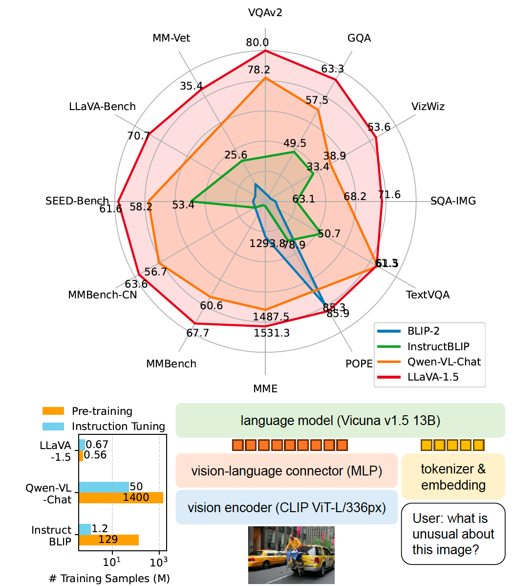
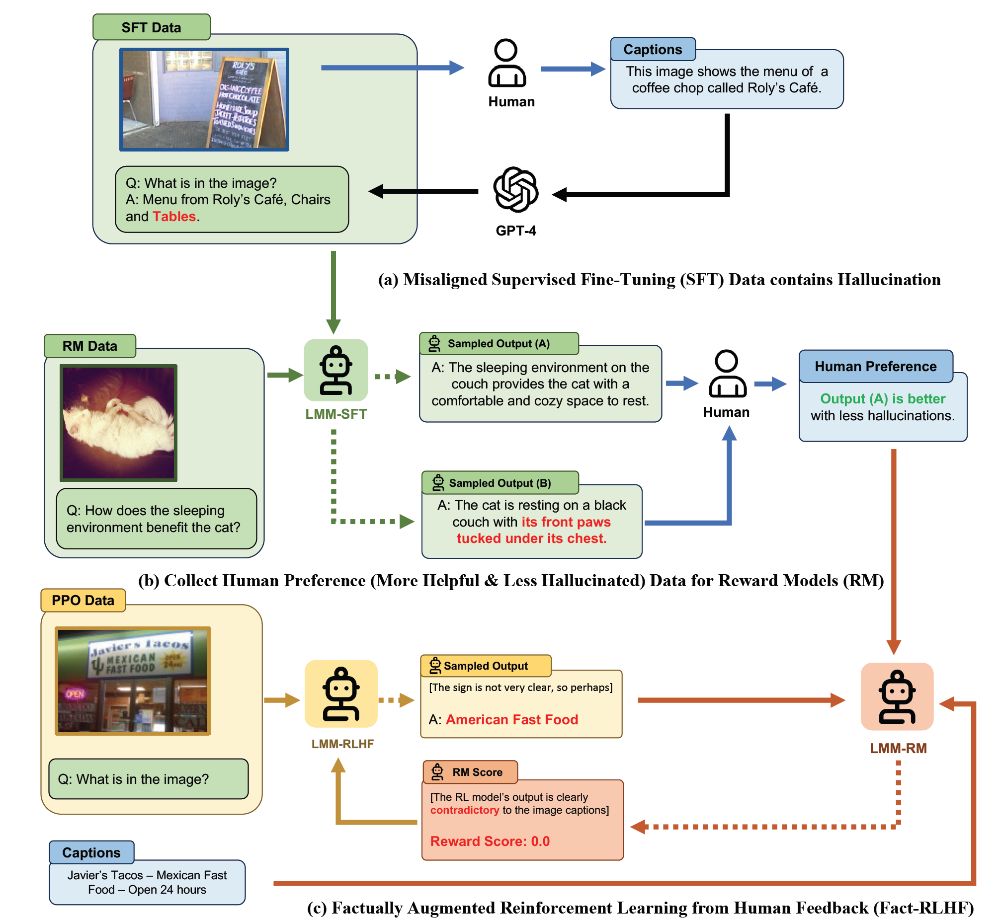

# My Brief Reading Notes

## Contents
- [My Brief Reading Notes](#my-brief-reading-notes)
  - [Contents](#contents)
  - [\[2023-10-13\] (COMM) From CLIP to DINO: Visual Encoders Shout in Multi-Modal Large Language Models](#2023-10-13-comm-from-clip-to-dino-visual-encoders-shout-in-multi-modal-large-language-models)
  - [\[2023-10-05\] (LLaVA-1.5) Improved Baselines with Visual Instruction Tuning](#2023-10-05-llava-15-improved-baselines-with-visual-instruction-tuning)
  - [\[2023-09-29\] The Dawn of LMMs: Preliminary Explorations with GPT-4V(ision)](#2023-09-29-the-dawn-of-lmms-preliminary-explorations-with-gpt-4vision)
  - [\[2023-09-25\] (LLaVA-RLHF) Aligning Large Multimodal Models with Factually Augmented RLHF](#2023-09-25-llava-rlhf-aligning-large-multimodal-models-with-factually-augmented-rlhf)
  - [\[2023-09-18\] An Empirical Study of Scaling Instruction-Tuned Large Multimodal Models](#2023-09-18-an-empirical-study-of-scaling-instruction-tuned-large-multimodal-models)

<!-- 
## [xxxx-xx-xx] Templete

***Publication:***

***Authors:***

***Affiliations:***

***Summary:***

***Model:***

***Method:***

***Data:***

***Observations:*** 
-->

## [2023-10-13] (COMM) From CLIP to DINO: Visual Encoders Shout in Multi-Modal Large Language Models

***Publication:***
arXiv 2023

***Authors:***

Dongsheng Jiang, Yuchen Liu, Songlin Liu, Xiaopeng Zhang, Jin Li, Hongkai Xiong, Qi Tian

***Affiliations:***

Huawei Cloud, Shanghai Jiao Tong University

***Summary:*** Analysis of visual encoders for LMMs.

***Model:***

1. Vision model: CLIP + DINO v2, concate their features after layer scaling
2. Language model: Vicuna (7B/13B)

***Method:***

Freeze visual encoder and tune LLM + alignment layer + feature fusion module

***Data:***

1. Stage1: Image Captioning + RefCOCO, visual genome, Viusal-7W.
2. Stage2: LLaVA-Instruct-150K + Shikra-RD.

***Observations:***

1. Shallow layer features of vision models offer advantages for fine-grained tasks such as grounding and region understanding, while deep layer features are superior at global understanding.
2. DINO without text-image alignment is promising, while MAE and DeiT perform inferiorly.

## [2023-10-05] (LLaVA-1.5) Improved Baselines with Visual Instruction Tuning

***Publication:*** arXiv 2023

***Authors:*** Haotian Liu, Chunyuan Li, Yuheng Li, Yong Jae Lee

***Affiliations:*** University of Wisconsin-Madison, Microsoft Research

***Summary:***

Several strategies to improve the performance of LLaVA.

***Model:***

1. Language model: LLaMA-7B or LLaMA-13B
2. Vision model: CLIP-ViT-L-336px
3. Vision-language connector: two-layer MLP

***Method:***

Improve over LLaVA:
1. Append "Answer the question using a single word or phrase" when prompting short answers.
2. Replace the linear projection with a two-layer MLP.
3. Add academic task oriented VQA data.
4. Scale up model to 13B.

***Data:***

665K image-text pairs, including LLaVA, ShareGPT, and some VQA datasets.

***Conclusions:***

LLaVA-1.5 achieves the best across 11 out of 12 benchmarks with the simplest architecture, academic compute and pubic datasets, and yields a fully-reproducible and affordable baseline. 

## [2023-09-29] The Dawn of LMMs: Preliminary Explorations with GPT-4V(ision)

***Publication:*** arXiv 2023

***Authors:*** Zhengyuan Yang, Linjie Li, Kevin Lin, Jianfeng Wang, Chung-Ching Lin, Zicheng Liu, Lijuan Wang

***Affiliations:*** Microsoft Corporation

***Summary:*** To deepen the understanding of large multimodal models (LMMs) by analyzing GPT-4V(ision). 

***Observations:***

- support flexible inputs
  - text-only inputs
  - a single image-text pair or a single image 
  - flexible interleaved image-text inputs
- support flexible working modes
  - text prompts
    - follow constrained prompt well, e.g., "return in the following JSON format {"class":xxx, "name": xxx}"
    - prefer condition prompt, e.g., "you are an expert in counting things, ..."
  - follow visual referring prompts well
    - understand prompts in different modes of visual pointing
  - follow flexible visual + text prompts well
  - in-context learning ability needs to be improved
    - prefer sufficient examples
- good quality and genericity
  - describe image well
    - celebrity recognition
    - landmark recognition
    - food recognition
    - medical image understanding
    - logo recognition
    - scene understanding
    - counterfactual examples
  - perform well in object localization, counting, and dense captioning
    - object counting and localization are more difficult
  - multimodal knowledge and commonsense
    - joke and meme
    - science and knowledge
    - multimodal commonsense
  - perfom well in scene text, table, chart, and document reasoning
    - scene text recognition
    - visual math reasoning
    - chart understanding and reasoning
    - table understanding and reasoning
    - document understanding
  - multilingual multimodal understanding
  - coding capability with vision
  - multi-image sequencing
  - video understanding
    - temporal ordering
    - temporal anticipation
    - temporal localization and reasoning
  - visual referring prompting for grounded temporal understanding
  - abstract visual reasoning
    - abstract visual stimuli
    - discovery and association of parts and objects
  - IQ and EQ test
- promising future directions
  - spot the difference
  - industry defect detection
  - safety inspection
  - medical, e.g., radiology report generation
  - auto insurance
  - customized captioner
  - image generation assistant
  - embodied agent
  - GUI navigation
    - web browsing
    - online shopping
    - notification understanding
    - watching videos

## [2023-09-25] (LLaVA-RLHF) Aligning Large Multimodal Models with Factually Augmented RLHF

***Publication:*** arXiv 2023

***Authors:*** Zhiqing Sun, Sheng Shen, Shengcao Cao, Haotian Liu, Chunyuan Li, Yikang Shen, Chuang Gan, Liang-Yan Gui, Yu-Xiong Wang, Yiming Yang, Kurt Keutzer, Trevor Darrell

***Affiliations:***

UC Berkeley, CMU, UIUC, UW-Madison, UMass Amherst, Microsoft Research, MIT-IBM Watson AI Lab

***Summary:***

1. Provide more high-quality instruction tuning data.
2. Propose the first multimodal RLHF method.
3. Improve reward model by using a better vision and language model and calibrating reward signals through factual augmentation.
4. Propose a new benchmark called MMHal-Bench, for hallucination evaluation.
5. Achieve 94% on LLaVA-Bench, previous best is 87%.

***Model:***

1. Language model: Vicuna-7B and Vicuna-13B
2. Vision model: ViT-L/14
3. Reward model: the same as language model

***Method:***

1. Supervised fine-tune a vision and a language model.
2. Human annotators compare two responses and pinpoint the more hallucinated one of 10k samples for training a reward/preference model (LoRA of the SFT model).
3. Train a policy model, initialized from SFT model, to maximize reward.

***Data:***

Additional training data: 98K conversions, where 10k is held out for preference modeling, 50k for RL training.

New benchmark: MMHal-Bench

***Conclusions:*** 

1. Use high-quality instruction tuning data improves hallucination.
2. RLHF helps LMMs to articulate uncertainties.
3. While RLHF enhances human alignment, reduces hallucination, and encourages truthfulness and calibration, applying RLHF can inadvertently dampen the performance of small-sized LMMs.

## [2023-09-18] An Empirical Study of Scaling Instruction-Tuned Large Multimodal Models

***Publication:*** arXiv 2023

***Authors:*** Yadong Lu, Chunyuan Li, Haotian Liu, Jianwei Yang, Jianfeng Gao, Yelong Shen

***Affiliations:*** Microsoft Azure AI, Microsoft Research, University of Wisconsin-Madison

***Summary:*** Empirical studies of model scaling, image resolution, data mixing, parameter-efficient training.

***Model:***

1. Vision model: CLIP ViT
2. Language model: Vicuna-13B, Vicuna-33B, Vicuna: 65B

***Method:***

Stage 1 of pre-training for feature alignment: train the linear projection using LAION-CC-SBU with 558K samples

Stage 2 of visual instruction tuning: train the linear projection and LLM (full-model or LoRA/QLoRA) using the LLaVA-80K dataset (or mix it with language-only instruct data ShareGPT).

***Data:***

***Observations:***

1. Scale LMM consistently enhances model performance.
2. LoRA/QLoRA are viable solutions to fine-tune large-scale LLMs for a good performance.
3. Using higher resolution of 336 consistently yields 2-3 points improvement.
4. By mixing language-only instruction data (ShareGPT) with LLaVA-80K yields 2 points improvement.
